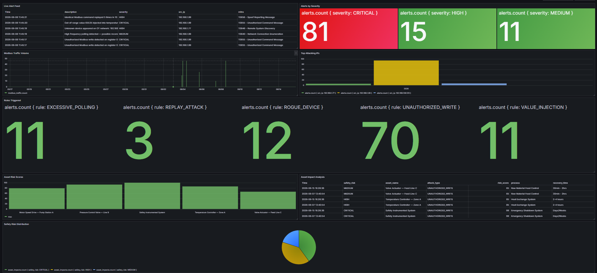

#  GUARDIAN — OT Threat Detection Platform

> Real-time ICS/OT network security monitoring platform
> Detects cyberattacks on industrial control systems



##  What is GUARDIAN?

GUARDIAN is a real-time threat detection platform
for OT/ICS networks. It passively monitors Modbus TCP
and OPC-UA protocols, detects attacks using 5 detection
rules, maps attacks to physical OT assets, visualizes
threats on a live Grafana dashboard, and auto-generates
daily PDF security reports.

> Mirrors what commercial products like Dragos and
> Claroty do — built free using open-source tools.

---

##  Key Features

| Feature | Description |
|---------|-------------|
|  Passive Traffic Capture | Monitors Modbus TCP without disrupting operations |
|  5 Detection Rules | Unauthorized write, rogue device, replay, polling, value injection |
|  Asset Impact Analyzer | Maps attacks to physical OT assets with consequence analysis |
|  Live Grafana Dashboard | 8-panel dashboard with real-time alerts |
|  Auto PDF Report | Daily security report auto-generated |
|  MITRE ATT&CK Mapping | All attacks mapped to ICS framework |

---

##  Architecture

```
Simulated OT Network
├── ModRSsim2      → Modbus TCP PLC (port 502)
└── node-opcua     → OPC-UA Server (port 4840)
        ↓
GUARDIAN Engine (Kali Linux)
├── guardian_capture.py   → Passive traffic capture
└── guardian_detect.py    → Detection + Asset Impact
        ↓
InfluxDB 1.8 (Time-series database)
        ↓
Grafana Dashboard (8 live panels)
        ↓
guardian_report_generator.py → Daily PDF report
```

---

##  Attack Scenarios

| Attack | Severity | MITRE TTP | Physical Impact |
|--------|----------|-----------|-----------------|
| Unauthorized Modbus Write | CRITICAL | T0855 | PLC register manipulated |
| Rogue Device Detection | HIGH | T0846 | Unknown device on OT network |
| Replay Attack | HIGH | T0856 | Commands repeated without auth |
| Excessive Polling | MEDIUM | T0840 | Process parameters mapped |
| Value Injection | CRITICAL | T0855 | False readings to operators |

---

##  OT Asset Impact Analyzer

Maps every attack to physical consequences:

```
Attack detected on Register 35
        ↓
Asset:    Safety Instrumented System
Risk:     CRITICAL
Impact:   Safety system may be disabled
Action:   Immediately notify safety officer
Recovery: Days/Weeks — full audit required
```

---

##  Grafana Dashboard

8 live panels:
-  Live Alert Feed
-  Modbus Traffic Volume
-  Alerts by Severity (CRITICAL: 81, HIGH: 15)
-  Top Attacking IPs
- 🔍 Rules Triggered
-  Asset Risk Scores (0-100)
-  Asset Impact Analysis
-  Safety Risk Distribution

---

##  Auto PDF Report (7 Pages)

- Cover page
- Executive Summary
- Alert Statistics
- Attack Timeline
- Asset Impact Analysis
- MITRE ATT&CK Mapping
- Remediation Roadmap (3 phases)

---

##  Tech Stack

```
Python 3     pymodbus, asyncua, scapy, influxdb, reportlab
Node.js      node-opcua (OPC-UA simulation)
InfluxDB 1.8 Time-series alert storage
Grafana OSS  Live visualization dashboard
ModRSsim2    Modbus TCP PLC simulation
Kali Linux   Attack simulation + traffic capture
Windows      OT infrastructure simulation
```

---

##  Project Structure

```
GUARDIAN/
├── server.js                         OPC-UA simulation
├── requirements.txt                  Python dependencies
├── package.json
├── Windows Files/
│   ├── test_data.py                  Test data generator
│   ├── guardian_asset_pusher.py      Asset data pipeline
│   ├── guardian_report_generator.py  PDF report generator
│   └── run_guardian_report.bat       Auto report launcher
├── Kali (Security Monitor)/
│   ├── attack_simulation.py          Attack engine
│   ├── guardian_capture.py           Traffic capture
│   └── guardian_detect.py            Detection + Asset Impact
└── docs/
    ├── guardian_dashboard.png         Dashboard screenshot
    └── GUARDIAN_Security_Report.pdf  Sample report
```

---

##  Quick Start

### Prerequisites
```
Windows: Node.js, Python 3, InfluxDB 1.8, Grafana, ModRSsim2
Kali:    Python 3, VMware (host-only network)
```

### Installation

**Windows:**
```bash
pip install -r requirements.txt
node server.js
.\influxd.exe
```

**Kali Linux:**
```bash
pip install -r requirements.txt --break-system-packages
sudo python3 guardian_capture.py
python3 attack_simulation.py
```

### Generate Report
```bash
python guardian_report_generator.py
```

---

## 🔗 Live Demo

Dashboard Screenshot:


Sample Report: [GUARDIAN_Security_Report.pdf](docs/GUARDIAN_Report_2026-06-10.pdf)

---

---

##  Author

**Shiv/0ff-t43-gri6** — B.Tech Cybersecurity Portfolio Project

---

##  License

MIT License — free to use, modify, and distribute
